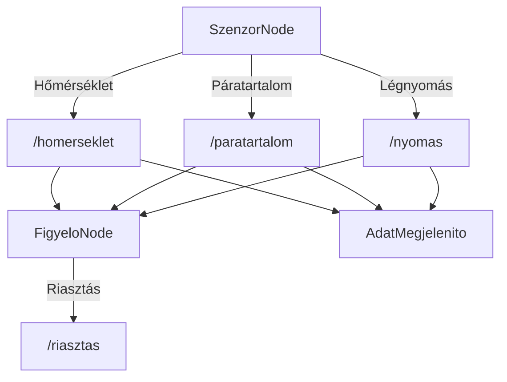
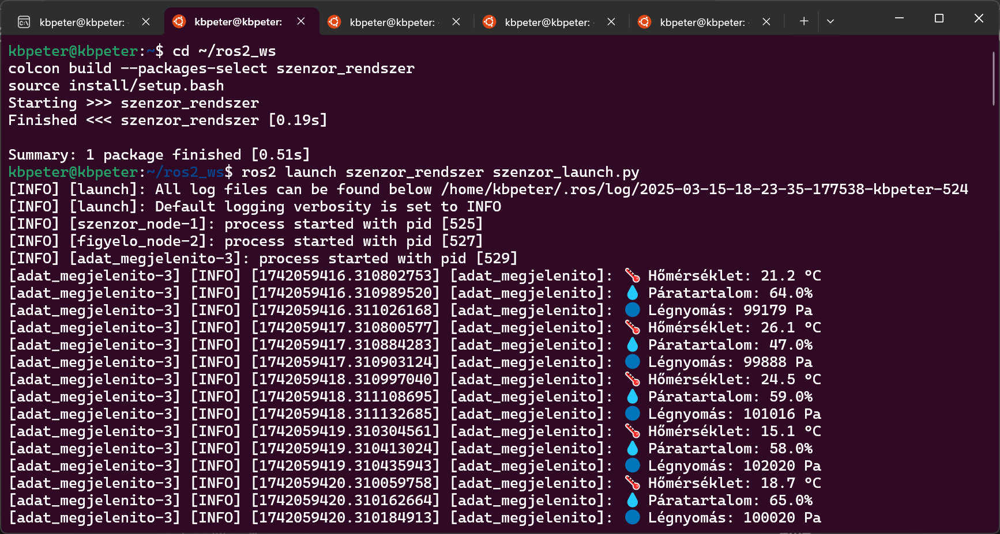
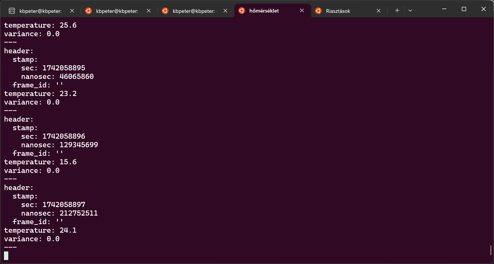
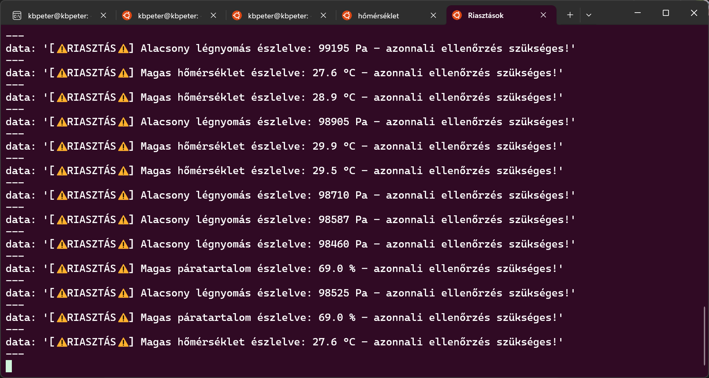

# Szenzor Rendszer - ROS 2 Beadandó

Ez a ROS 2 csomag egy egyszerű **hőmérséklet-, páratartalom- és nyomásérzékelő rendszert** szimulál. A rendszer tartalmaz:
- **Egy Szenzor Node-ot**, amely véletlenszerű szenzoradatokat generál.
- **Egy Figyelő Node-ot**, amely a küszöbértékeket ellenőrzi és riasztást küld szükség esetén.
- **Egy Adatmegjelenítő Node-ot**, amely emberileg olvasható formában írja ki az adatokat.

## 🔍 Hasonlóságok és Különbségek egy Minta Beadandóhoz

Ez a projekt hasonlít egy korábbi minta beadandóhoz ([példa](https://github.com/gfigneczi1/ign_b7e_temp_sens)), amely szintén egy szenzor-rendszert implementál. A legfontosabb eltérések:
- **További szenzoradatok**: Az eredeti beadandó csak hőmérsékletet és páratartalmat figyelt, míg ebben a verzióban a **légnyomás** is szerepel.
- **Fejlettebb adatmegjelenítés**: Egy külön `adat_megjelenito` node készült, amely **ikonokkal és jól formázott kiírással** jeleníti meg az adatokat.
- **Jobb riasztáskezelés**: A riasztások figyelmeztető **ikonokkal és egységesített formátummal** jelennek meg, így könnyebben értelmezhetők.

## 📦 Telepítés és Fordítás

A rendszer telepítéséhez és fordításához az alábbi lépéseket kövesse:

```bash
cd ~/ros2_ws/src
git clone https://github.com/kbpeter/kov_n1r_autonom.git
cd ~/ros2_ws
colcon build --packages-select szenzor_rendszer
source install/setup.bash
```

## 🚀 Futtatás

A csomag futtatásához:

```bash
ros2 launch szenzor_rendszer szenzor_launch.py
```

Ezzel a három node egyszerre indul el.

## 📡 Elérhető Topicok

| Topic Név          | Típus                           | Leírás                                    |
|--------------------|---------------------------------|-------------------------------------------|
| `/homerseklet`     | `sensor_msgs/Temperature`       | Generált hőmérséklet adatok (°C)         |
| `/paratartalom`    | `sensor_msgs/RelativeHumidity`  | Generált páratartalom adatok (%)         |
| `/nyomas`          | `sensor_msgs/FluidPressure`     | Generált légnyomás adatok (Pa)           |
| `/riasztas`        | `std_msgs/String`               | Riasztás küszöbérték túllépésekor        |

## 🔍 Adatok Figyelése

A generált adatokat és riasztásokat az alábbi parancsokkal ellenőrizheti:

```bash
ros2 topic echo /homerseklet
ros2 topic echo /paratartalom
ros2 topic echo /nyomas
ros2 topic echo /riasztas
```

Ha szeretné az adatokat könnyebben olvasható módon megjeleníteni, használja az adatmegjelenítő node-ot:

```bash
ros2 run szenzor_rendszer adat_megjelenito
```

Várt kimenet:

```
🌡️ Hőmérséklet: 26.7 °C
💧 Páratartalom: 65.2 %
🔵 Légnyomás: 99600 Pa
```

## 🖼️ Mermaid Diagram



## 📸 Képernyőképek

Az alábbi képek bemutatják a rendszer működését:







## 🔧 Fejlesztői Információk

- **GitHub Repository:** [kov_n1r_autonom](https://github.com/kbpeter/kov_n1r_autonom)
- **Készítette:** Kovács Boldizsár Péter
- **KNeptun kód:** N1RG50
- **Email:** p.boldi.kovacs@gmail.com
- **Licenc:** Apache 2.0
